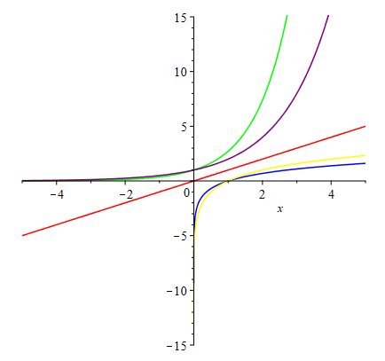
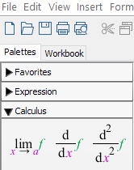
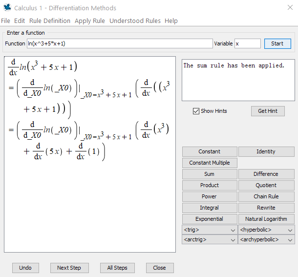
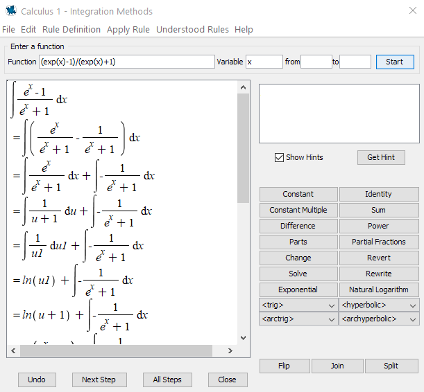

# Logarithmic and Exponential Functions

## Basic properties and graphs

The natural logarithmic function $y=\ln(x)$ is defined by $\ln(x)=\int_1^x\frac{1}{t}\mathrm{d} t$.

The natural exponential function $y=e^x$ is defined as the inverse function of $y=\ln(x)$.

From the definition, we have very important identities
$$
\ln(e^x)=x\qquad \text{and}\qquad e^{\ln x}=x.
$$

<!-- In mathematics, an identity is an equality that always holds true when assigning values to the same variable in both sides. -->

Using those two identities, we may define general exponential functions and general logarithmic function, and deduce the Law of Logarithms and Law of Exponents.

- For any positive number $b\ne 1$, we have $b^x=(e^{\ln b})^x=e^{x\ln b}$.

- For any positive number $b\ne 1$, we define $y=\log_bx$ to be the inverse function of $y=b^x$

- By solving $x=b^y$ for $y$, we find that $\log_bx=\dfrac{\ln x}{\ln b}$. This identity is called the change of base property.

How do graphs of logarithmic functions and exponential functions look like?

\BeginKnitrBlock{example}
<strong>(\#exm:unnamed-chunk-1) </strong>
Graph the following functions together.
$$
y=\ln x, \qquad y=e^x, \qquad y=2^x, \qquad y=\log_2x, y=x.
$$

\EndKnitrBlock{example}

\BeginKnitrBlock{solution}
\iffalse{} <em>Solution. </em>  \fi{} 
In Maple, the logarithm $\log_bx$ is given by `log[b](x)`. When $b=e$, you simply use `ln(x)` for $\ln x$. When $b=10$, you may also use `log(x)` or `log10(x)` for $\log_{10}x$.

The exponent $b^x$ is given by `b^x` in Maple. When $b=e$, you may also use `exp(x)` to represent $e^x$.

To graph the functions together with different colors, we use the following command

    plot([ln(x), exp(x), 2^x, log[2](x), x], x=-5..5, color=[blue, green, purple, yellow, red])

Here is the output

\EndKnitrBlock{solution}

\BeginKnitrBlock{exercise}
<strong>(\#exr:unnamed-chunk-3) </strong>Graph the following functions together.
$$
y=\log_3x, \qquad y=3^x, \qquad y=(1/3)^x, \qquad y=\log_{1/3}x.
$$

Find the pairs that are symmetric to each other with respect to a certain line.

\EndKnitrBlock{exercise}

\BeginKnitrBlock{exercise}
<strong>(\#exr:unnamed-chunk-4) </strong>Graph the following functions together.
$$
y=0.5^x, \qquad y=2^x, \qquad y=5^x.
$$

Describe the monotonicity (increasing/decreasing) of the functions?

Fix an input $x$. Describe how $y$-values change when bases changes from small number to bigger number?

\EndKnitrBlock{exercise}

\BeginKnitrBlock{exercise}
<strong>(\#exr:unnamed-chunk-5) </strong>Graph the following functions together.
$$
y=\log_{0.5}x, \qquad y=\log_2x, \qquad y=\log_{5}x.
$$

Describe the monotonicity (increasing/decreasing) of the functions?

Fix an input $x$. Describe how $y$-values change when bases changes from small number to bigger number?

\EndKnitrBlock{exercise}

## Differentiation and integration

In Maple, one way to do differentiation and integration is to use the `Calculus Palette` on the left side.

The other way is to use the commands `diff(f(x), x)` , `int(f(x), x)`, and `int(f(x), x=a..b)`.

Supported by the `Student[Calculus1]` package, Maple also provides the tutor commands `DiffTutor()` and `IntTutor()` which can show step-by-step solution of differentiation and integration.

Note you may also access tutor commands from the `Start` page (click the home button in the toolbar and look for Calculus).

\BeginKnitrBlock{example}
<strong>(\#exm:unnamed-chunk-6) </strong>Find $y'$, where $y=\ln \left(x^{3}+5x+1\right)$.
\EndKnitrBlock{example}

\BeginKnitrBlock{solution}
\iffalse{} <em>Solution. </em>  \fi{} 
Using `diff`:

    diff(ln(x^3+5*x+1), x)

We get
$$
y'=\dfrac{3x^{2}+5}{x^{3}+5 x+1}.
$$

Type in (assume that `with(Student[Calculus1])` was run)

    DiffTutor(ln(x^3+5*x+1), x)

and hit enter you will see

By click `Next Step` or `All Steps` you will see detailed solution with rules used.

\EndKnitrBlock{solution}

\BeginKnitrBlock{example}
<strong>(\#exm:unnamed-chunk-8) </strong>Evaluate the integral
$$
\int\dfrac{e^x-1}{e^x+1}\mathrm{d} x.
$$
\EndKnitrBlock{example}

\BeginKnitrBlock{solution}
\iffalse{} <em>Solution. </em>  \fi{} 
Using `int`:

    int((exp(x)-1)/(exp(x)+1), x)

We get
$$
\int\dfrac{e^x-1}{e^x+1}\mathrm{d} x=2 \ln \left(\mathrm{e}^{x}+1\right)- x+C.
$$

Type in (assume that `with(Student[Calculus1])` was run)

    IntTutor((exp(x)-1)/(exp(x)+1), x)

and hit enter you will see

By click `Next Step` or `All Steps` you will see detailed solution with rules used.

\EndKnitrBlock{solution}

\BeginKnitrBlock{exercise}
<strong>(\#exr:unnamed-chunk-10) </strong>
Find the derivative $\frac{\mathrm{d} y}{\mathrm{d} x}$, where $y=\ln|\cos x|$

\EndKnitrBlock{exercise}

\BeginKnitrBlock{exercise}
<strong>(\#exr:unnamed-chunk-11) </strong>
Find the derivative $\frac{\mathrm{d} y}{\mathrm{d} x}$, where $y=x^{\cos x}$

\EndKnitrBlock{exercise}

\BeginKnitrBlock{exercise}
<strong>(\#exr:unnamed-chunk-12) </strong>
Evaluate the integral
$$
\int \frac{\left(e^{4x}+e^{2x}\right)}{e^{3x}} d x
$$

\EndKnitrBlock{exercise}

\BeginKnitrBlock{exercise}
<strong>(\#exr:unnamed-chunk-13) </strong>
Evaluate the integral
$$
\int 2^{3x} d x
$$

\EndKnitrBlock{exercise}
