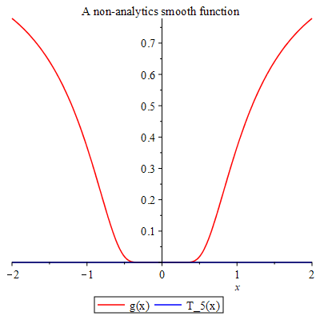

# Taylor Expansion

Let $f(x)$ be a function. Assume that the $k$-th order derivatives $f^k(a)$ exist for $k=1, 2, \dots, n$. The polynomial
$$
T_n(x)=\sum_{k=0}^n\dfrac{f^{(n)}(a)}{k!}(x-a)^k
$$
is called the $n$-th degree Taylor polynomial of $f$ at $a$.

Let $f(x)$ be a function has derivative at $a$ up to all orders. Set
$$
R_n(x)=\sum_{k=n+1}^\infty \dfrac{f^{(k)}(a)}{k!}(x-a)^k,\quad\quad \left|x-a\right|<R,
$$
which is called the reminder of the Taylor series
$$
\sum\limits_{k=0}^\infty \dfrac{f^{(k)}(a)}{k!}(x-a)^k.
$$

If
$$
\lim\limits_{n\to\infty} R_n(x)=0
$$
for $\left|x-a\right|<R$, then $f(x)$ is the sum of the Taylor series on the interval, that is
$$
f(x)=\sum\limits_{k=0}^\infty \dfrac{f^{(k)}(a)}{k!}(x-a)^k,\quad\quad \left|x-a\right|<R.
$$

If $\left|f^{n+1}{x}\right|\leq M$ for $\left|x-a\right|\leq d$, then the reminder $R_n$ satisfies the follow inequality
$$
\left|R_n(x)\right|\leq \dfrac{M}{n+1}\left|x-a\right|^{n+1}\quad \text{for}\quad \left|x-a\right|\leq d.
$$

Roughly speaking, the absolute value of the reminder $\left|R_n(x)\right|$ determines how accurate the Taylor polynomial approximation.

\BeginKnitrBlock{example}
<strong>(\#exm:unnamed-chunk-1) </strong>
Approximate function $f(x)=\sin x$ by the degree 3 Taylor polynomial at $x=1$.  

\EndKnitrBlock{example}

\BeginKnitrBlock{solution}
\iffalse{} <em>Solution. </em>  \fi{} 

    # Find the Taylor series.

    fTs:=taylor(sin(x), x = 0, 4)

    # Convert the Taylor series into a polynomial

    fTp:=convert(fTs, polynom)

    # Evaluate the Taylor polynomial at 1

    subs(x=1, fpolyapprox)

\EndKnitrBlock{solution}

\BeginKnitrBlock{example}
<strong>(\#exm:unnamed-chunk-3) </strong>
Plot the function
$$
g(x)=\begin{cases}e^{-\frac{1}{x^2}} & x\neq 0\\ 0 & x=0\end{cases}
$$
and its 5-th order Taylor polynomial over the domain $[-2..2]$. What can you conclude?

\EndKnitrBlock{example}

\BeginKnitrBlock{solution}
\iffalse{} <em>Solution. </em>  \fi{} 

    # Define a piece-wisely defined function.

    g:=piecewise(x!=0, exp(-1/x^2), 0)

    # Find Taylor polynomial of degree 5.

    for n to 5 do T := (eval(diff(g(x), x$n), x = 0))*x^n/factorial(n)+T end do

    # Plot the functions

    plot([g,T],x=-2..2, color=[red, blue])

The graphs of the functions are shown in the picture.

\EndKnitrBlock{solution}

In the solution, `x$n` is a shortcut option for `x, x, x, x, x` in the `diff` command.

\BeginKnitrBlock{exercise}
<strong>(\#exr:unnamed-chunk-5) </strong>
Approximate function $f(x)=e^x$ by the degree 5 Taylor polynomial at $x=1$.

\EndKnitrBlock{exercise}

\BeginKnitrBlock{exercise}
<strong>(\#exr:unnamed-chunk-6) </strong>
Compare the function $y=\sin x$ with its degree 10 Taylor polynomial at $x=0$.

\EndKnitrBlock{exercise}
