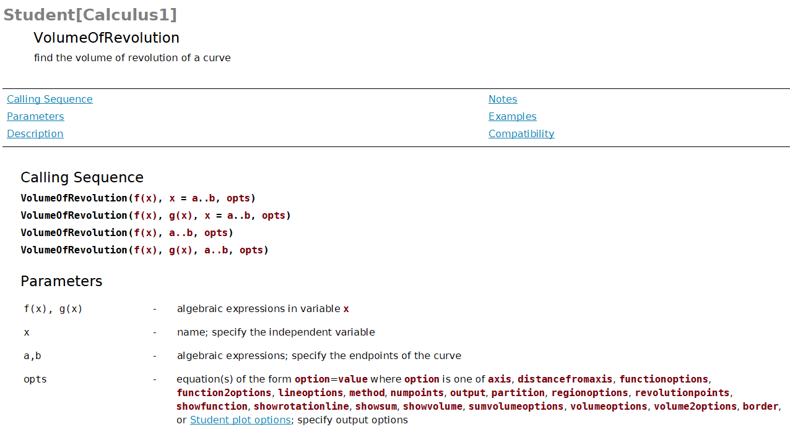
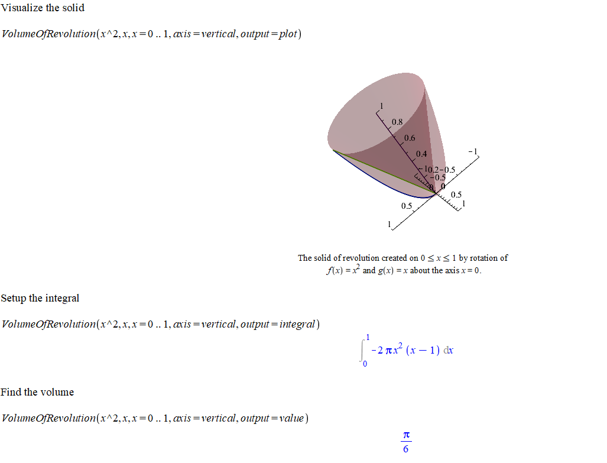

# (PART\*) Part 2 - Calculus II {-}

# Volume of Revolution

In terms of definite integrals, the volume of a solid obtained by rotating a region about the $x$-axis can be calculated by 
$$\int_a^b \pi (r_1(x)^2 - r_2(x)^2) \mathrm{d} x \qquad \text{disk/washer method},$$
or
$$\int_a^b 2\pi r(y) h(y) \mathrm{d} y \qquad \text{shell method method},$$

where $r_1(x)$, $r_2(x)$ and $r(x)$ represents the radius and $h(x)$ represents the height of a cylindrical shell.

In practice, it's better to recognize the shape of a cross section, find the volume of a slice of the solid and then set up the integral.

In the following, you will see some tools/commands from Maple which are very helpful to calculate the volume of a solid.

In Maple, the following command, supported by the package `Student[Calculus1]`, can be used to get the graph, the integral and the volume of the solid obtained by rotation the region bounded by $f(x)$, $g(x)$, $x=a$ and $x=b$.

```maple
VolumeOfRevolution(f(x), g(x), x = a..b, opts)
```

To learn what options does the command `VolumeOfRevolution` have, you may type

```maple
?VolumeOfRevolution
```

in the Math mode and hit enter. You will see the help page.



\BeginKnitrBlock{example}<div class="example"><span class="example" id="exm:unnamed-chunk-1"><strong>(\#exm:unnamed-chunk-1) </strong></span>Show the solid obtained by rotating the region bounded by $y=x^2$ and $y=x$ about $y$-axis. Set up an integral for the volume. Find the volume.</div>\EndKnitrBlock{example}

\BeginKnitrBlock{solution}<div class="solution">\iffalse{} <span class="solution"><em>Solution. </em></span>  \fi{}<br>

#Load the package

    with(Student[Calculus1])

#Show the solid

    VolumeOfRevolution(x^2, x, x = 0 .. 1, axis = vertical, output = plot)

#Set up an integral

    VolumeOfRevolution(x^2, x, x = 0 .. 1, axis = vertical, output = integral)

#Find the volume

    VolumeOfRevolution(x^2, x, x = 0 .. 1, axis = vertical, output = value)

The outputs in Maple can be seen in the following picture

</div>\EndKnitrBlock{solution}

\BeginKnitrBlock{remark}<div class="remark">\iffalse{} <span class="remark"><em>Remark. </em></span>  \fi{}1. If you change the function to `VolumeOfRevolutionTutor`, you will see an interactive popup windows which does exactly the same thing.

2. If the rotation axis is not an axis of the coordinate system, you need add the option `distancefromaxis = numeric` into the function. For example, if in the above example, the rotation is about $y=-2$, then the Maple command should be the following

        VolumeOfRevolution(x^2, x, x = 0 .. 1, axis = vertical, distancefromaxis = -2, output = integral)
</div>\EndKnitrBlock{remark}

\BeginKnitrBlock{exercise}<div class="exercise"><span class="exercise" id="exr:unnamed-chunk-4"><strong>(\#exr:unnamed-chunk-4) </strong></span>Find the volume of the solid obtained by rotating the region bounded by $y=x^3$, $x=0$, $y=1$ about $y$-axis</div>\EndKnitrBlock{exercise}

\BeginKnitrBlock{exercise}<div class="exercise"><span class="exercise" id="exr:unnamed-chunk-5"><strong>(\#exr:unnamed-chunk-5) </strong></span>Find the volume of the solid obtained by rotating the region bounded by $y=x^3$, $y=0$, $x=1$ about (a) $y=0$, and (b) $x=2$.</div>\EndKnitrBlock{exercise}
