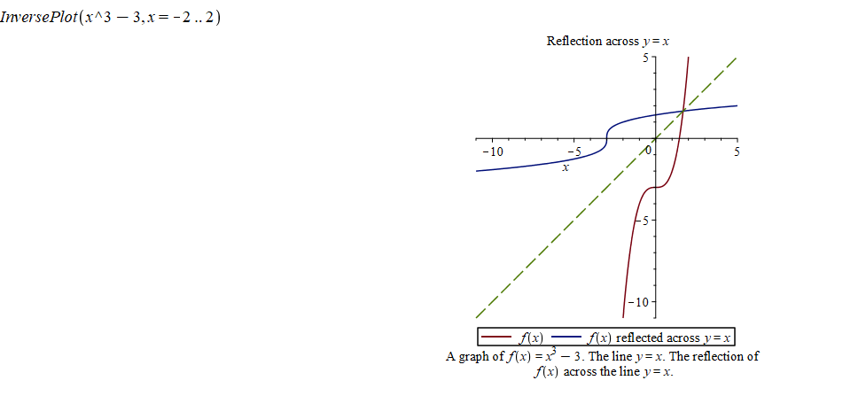

# Inverse Functions

Maple package `Student[Calculus1]` provides the following command

```maple
InversePlot(f(x), x = a..b);
```

which graphs the original function $f(x)$ and the inverse function $f^{-1}(x)$ together over the interval $[a, b]$.

You will see clearly that the graphs of a function and its inverse are symmetric with respect to the line $y=x$.

\BeginKnitrBlock{example}<div class="example"><span class="example" id="exm:unnamed-chunk-1"><strong>(\#exm:unnamed-chunk-1) </strong></span><br>
  
1. Graph the function $f(x)=x^3-2$, its inverse function, and the line $y=x$ over the interval $[-2,2]$.

2. Find the inverse function.
</div>\EndKnitrBlock{example}

\BeginKnitrBlock{solution}<div class="solution">\iffalse{} <span class="solution"><em>Solution. </em></span>  \fi{}<br>
One way to plot the function and its inverse together is to use the following command which is supported by the package `Student[Calculus1]`.

      InversePlot(x^3-3, x = -2 .. 2)

Here is the output in Maple



Another way to plot the function $f$ and its inverse $g$ together uses the `plot` function.

      plot([f(x), g(x), x], x = -2 .. 4, y = -5 .. 5, color = [red, black, blue])

To find the inverse function, we replace $f(x)$ by $y$, then switch $x$ and $y$, and solve for $y$. In Maple, you may use the command `solve(equation/inequality, variable)` to solve an equation or an inequality (even system of equations/inequalities).

In this example, we may find the inverse function by type in the following command. Note I have switch $x$ and $y$.

    solve(x=y^3, y)
</div>\EndKnitrBlock{solution}

To find the derivative of the inverse function of a function $f$ at a given point $x=a$, we may apply the formula
$$(f^{-1})'(a)=\dfrac{1}{f'(f^{-1}(a))}.$$
In Maple, we may use the following commands to calculate the value of the derivative function.

- Calculate the derivative of the function $f$.

```maple

diff(f(x), x)

```

- Find $f^{-1}(a)$ which is the solution of the equaiton $f(x)=a$.

```maple

solve(f(x)=a, x)

```

- Plug in the formula to evaluate.

```maple

eval(subs(x=f^{-1}(a), 1/f'(x)))

```

\BeginKnitrBlock{example}<div class="example"><span class="example" id="exm:unnamed-chunk-3"><strong>(\#exm:unnamed-chunk-3) </strong></span>Find $(f^{-1})'(0)$, where $f(x)=\cos(x)$ and $0\leq x\leq \pi$.</div>\EndKnitrBlock{example}

\BeginKnitrBlock{solution}<div class="solution">\iffalse{} <span class="solution"><em>Solution. </em></span>  \fi{}<br>
Find the derivative of $f$
  
    diff(cos(x), x)

Find the value of $f^{-1}(0)$
  
    solve(cos(x)=0, x)

Apply the formula

    eval(subs(x=Pi/2, -1/sin(x)))

Using Maple, we find $(f^{-1})'(0)=-1$.</div>\EndKnitrBlock{solution}

\BeginKnitrBlock{exercise}<div class="exercise"><span class="exercise" id="exr:unnamed-chunk-5"><strong>(\#exr:unnamed-chunk-5) </strong></span>
1. Graph the function $f(x)=3+2\sin x$, its inverse function, and the line $y=x$ over the interval $[-2,2]$.

2. Find the value $(f^{-1})'(5)$.
</div>\EndKnitrBlock{exercise}


