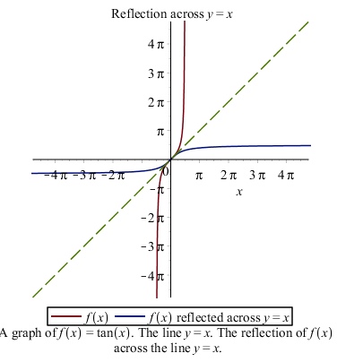

# Inverse Trigonometric Functions

## Domains and Ranges

To define the inverse function, the original function must be a one-to-one function.
For a trigonometric function, we have to restrict the function over a specific domain to ensure that the function is one-to-one.
For simplicity, we pick domains near the origin for trigonometric functions. To be more precise, we consider the following trigonometric functions:
$$
y=\sin x,\quad -\pi/2\leq x\leq \pi/2 ~~\text{and}~ -1\leq y\leq 1;
$$

$$
y=\cos x,\quad 0\leq x\leq \pi ~~\text{and}~ -1\leq y\leq 1;
$$

$$
y=\tan x,\quad -\pi/2< x< \pi/2 ~~\text{and}~ -\infty<y<\infty.
$$

Their inverse functions are

$$
y=\arcsin x,\quad -\pi/2\leq y\leq \pi/2 ~~\text{and}~ -1\leq x\leq 1;
$$

$$
y=\arccos x,\quad 0\leq y\leq \pi ~~\text{and}~ -1\leq x\leq 1;
$$

$$
y=\arctan x,\quad -\pi/2< y< \pi/2 ~~\text{and}~ -\infty< x<\infty.
$$

To see the graphs of the functions, we may use the `plot(f(x), x = a..b, opts)` command. Or, to graph $f$, $f^{-1}$ and $y=x$ together, we may also use the command `InversePlot(f(x), x = a..b, opts)` supported by the package `Student[Calculus1]`.

\BeginKnitrBlock{example}
<strong>(\#exm:unnamed-chunk-1) </strong>
Graph the following functions together.
$$
y=\tan x, \qquad y=\arctan x, \qquad y=x.
$$

\EndKnitrBlock{example}

\BeginKnitrBlock{solution}
\iffalse{} <em>Solution. </em>  \fi{} 

    #load the package ``Student[Calculus1]".
    with(Student[Calculus1])
    #plot the functions
    InversePlot(tan(x),x=-Pi/2..Pi/2)

Here is the output

\EndKnitrBlock{solution}

\BeginKnitrBlock{exercise}
<strong>(\#exr:unnamed-chunk-3) </strong>
Graph the following functions together over an appropriate domain.
$$
y=\cot x, \qquad y=\mathrm{arccot} x, \qquad y=x.
$$

What's the domain and range of $y=\mathrm{arccot} x$?

\EndKnitrBlock{exercise}

## Differentiation and integration of inverse trigonometric functions

In the section {#Differentiation and integration of logarithmic and exponential functions}, we learned to how use Maple to learn differentiation and integration.

Now let find derivatives and integrals of some inverse trigonometric functions.

\BeginKnitrBlock{example}
<strong>(\#exm:unnamed-chunk-4) </strong>
Find $y'$, where $y=\mathrm{arccot} x$.

\EndKnitrBlock{example}

\BeginKnitrBlock{solution}
\iffalse{} <em>Solution. </em>  \fi{} 

Surely, we may use `diff` or `DiffTutor` to find the derivative.

Here let's me introduce to you another command `implicitdiff`.

We've learned that (see {#Inverse Functions}) to find the inverse function, we switch $x$ and $y$ and then solve for $y$. When finding the derivative, we don't have to solve for $y$ instead, we want $y'$ which is implicitly defined by an equation. In this case, we have $x=\mathrm{arccot}y$.

Enter the following commands in Maple, you will find $y'=-\frac{1}{x^2+1}$.

    implicitdiff(x=cot(y), y, x)
    subs(cot(y) = x, %)

where `%` is a ditto operator that allows you to refer to a previously computed result in Maple.

\EndKnitrBlock{solution}

\BeginKnitrBlock{exercise}
<strong>(\#exr:unnamed-chunk-6) </strong>
Find the derivative of $y=\mathrm{arcsec} x$

\EndKnitrBlock{exercise}

\BeginKnitrBlock{exercise}
<strong>(\#exr:unnamed-chunk-7) </strong>
Find the derivative of $y=\mathrm{arccsc} x$

\EndKnitrBlock{exercise}

For integrals of inverse trigonometric function, you may need the method of integration by parts.

Use `DiffTutor` to find antiderivatives of inverse trigonometric functions.

\BeginKnitrBlock{exercise}
<strong>(\#exr:unnamed-chunk-8) </strong>
Evaluate the integral
$$
\int \arcsin x \mathrm{d} x
$$

\EndKnitrBlock{exercise}

\BeginKnitrBlock{exercise}
<strong>(\#exr:unnamed-chunk-9) </strong>
Evaluate the integral
$$
\int \arctan x \mathrm{d} x
$$

\EndKnitrBlock{exercise}

\BeginKnitrBlock{exercise}
<strong>(\#exr:unnamed-chunk-10) </strong>
Evaluate the integral
$$
\int \mathrm{sec} x \mathrm{d} x
$$

\EndKnitrBlock{exercise}
